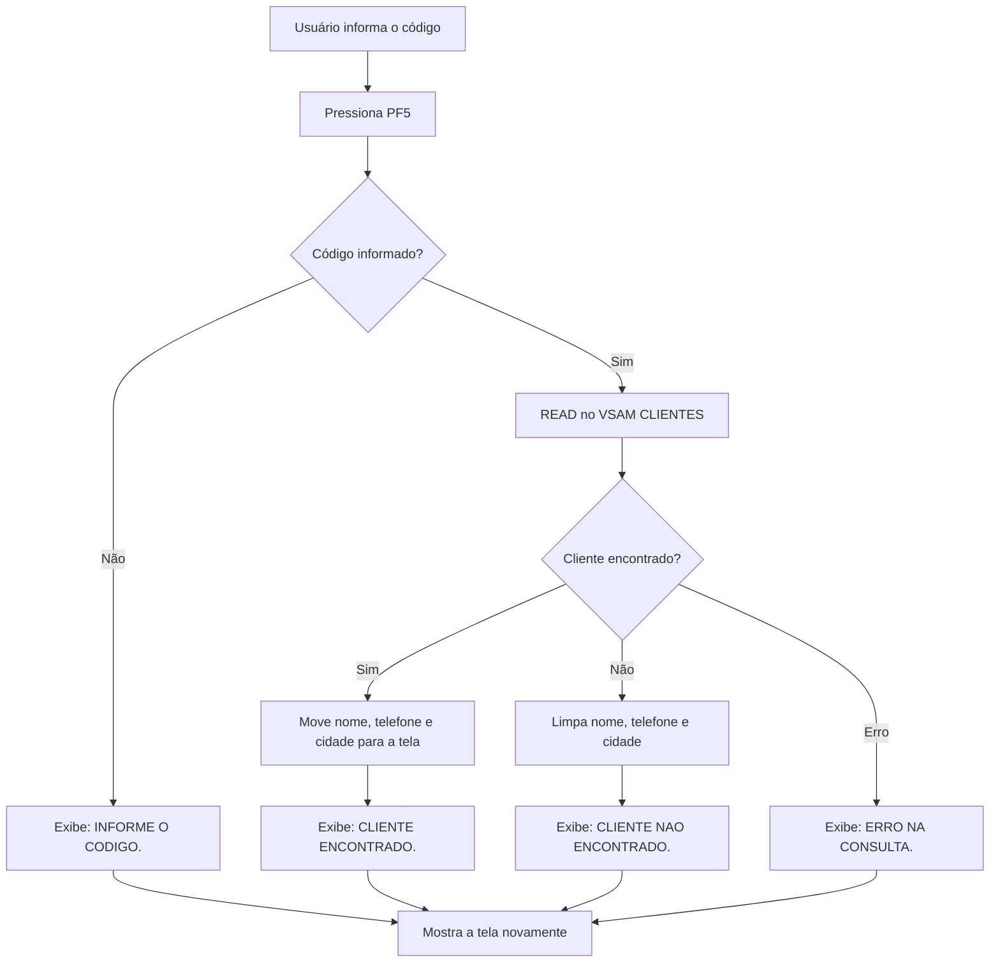
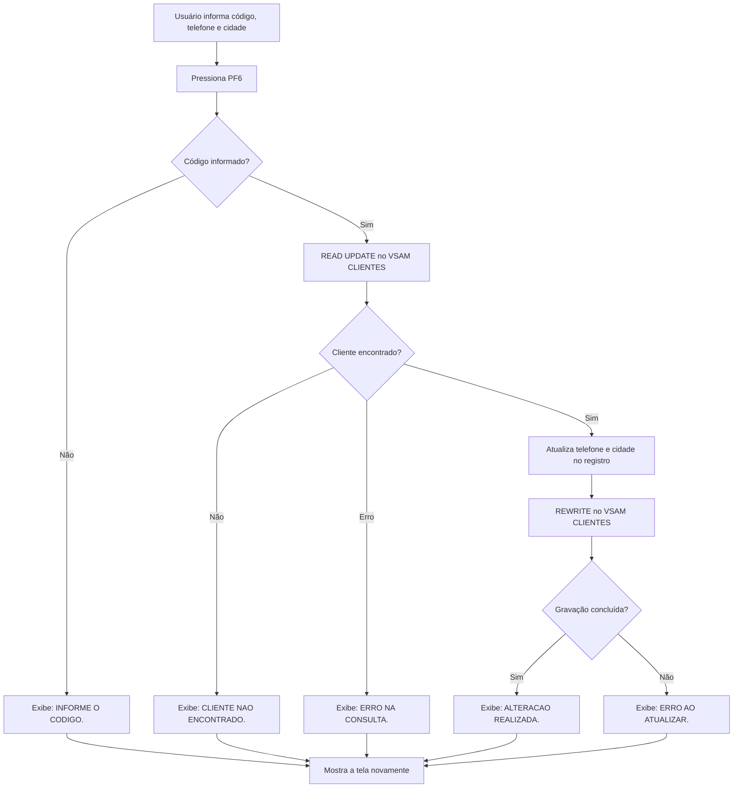

# Projeto Consulta e Atualização de Clientes em CICS

Projeto desenvolvido em COBOL no ambiente **TK5/MVS 3.8j**, utilizando **TN3270** e **KICKS** para simular ambiente CICS.

O sistema implementa uma aplicação online para consulta e atualização de clientes armazenados em um arquivo VSAM. A transação `CLIE` executa o programa `CADCLI`, que interage com uma tela BMS e com o arquivo `CLIENTES`.

---

## Demonstração

### 1. Consultando um cliente (PF5)


### 2. Editando telefone e cidade (PF6)


### 3. Confirmando a alteração — novo acesso ao KICKS


---

## Tela do Sistema

>


---

## Lógica de Funcionamento

Ao executar a transação `CLIE`, o sistema apresenta a tela de consulta de clientes.

O usuário informa o código do cliente e utiliza as teclas de função para consultar, alterar ou sair da transação.

* **PF5** consulta o cliente pelo código informado.
* **PF6** atualiza somente telefone e cidade.
* **PF3** encerra a transação e retorna ao terminal do KICKS.

---

## Em Funcionamento no TK5 com o KICKS com testes das funcionalidades

> *Coloque aqui um print ou gif do sistema em execução*

---

## Fluxograma PF5 - Consulta



---

## Fluxograma PF6 - Atualização



---

## Arquivos do Projeto

```text
src/CADCLI.cbl      Programa COBOL executado pela transação CLIE
src/MAPSCA.bms      Fonte do mapa BMS da tela
jcl/DEFCLI.jcl      JCL para criar e carregar o arquivo VSAM CLIENTES
jcl/MAPP7.jcl       JCL para gerar o mapa BMS
jcl/BUILDP7.jcl     JCL para compilar e linkar o programa COBOL
jcl/ASMCLIE.jcl     JCL para registrar a transação nas tabelas do KICKS
```

---

### Configuração de apoio usada no KICKS

Para a aplicação funcionar no ambiente KICKS, foram necessários mais alguns arquivos configurados:

```text
PCT  -> A transação CLIE apontando para o programa CADCLI
PPT  -> Programa CADCLI e mapset MAPSCA
FCT  -> Arquivo VSAM CLIENTES
```

Essas configurações foram montadas via Assembler (job ASMCLIE) para registrar as tabelas binárias do KICKS (KIKPCTB$, KIKPPTB$, KIKFCTB$).

---

## Comandos CICS/KICKS Utilizados

```text
SEND      Envia a tela BMS para o terminal
RECEIVE   Recebe os campos preenchidos pelo usuário
RETURN    Encerra a transação
READ      Consulta o cliente no VSAM
REWRITE   Atualiza o registro no VSAM
```

---

## Objetivo do Projeto

Este projeto tem como objetivo praticar desenvolvimento COBOL online em ambiente mainframe, utilizando transações CICS/KICKS, mapa BMS, interação com terminal 3270, consulta e atualização de registros VSAM. A aplicação foi executada com sucesso no ambiente TK5/KICKS, permitindo consultar clientes e persistir alterações de telefone e cidade.
